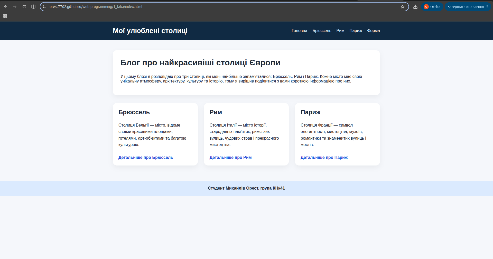

# Звіт до лабораторної роботи № 1

### Імплементація блогу «Мої 3 найкращі міста світу». Розміщення проєкту в репозиторії GitHub

---
---

## Тема

Імплементація статичного web-блогу «Мої 3 найкращі міста світу» з використанням семантичної HTML-розмітки, організація проєкту в Git-репозиторії, розміщення його на GitHub та розгортання за допомогою GitHub Pages.

## Мета роботи

Метою лабораторної є набуття практичних навичок проєктування багатосторінкового статичного web-сайту, та його публікація в Інтернет.

## Виконання роботи

* було створенно 5 html сторінок:
  * `index.html` - головна сторінка;
  * `form.html` - сторінка з формою для зворотнього зв'язку;
  * `city1.html` - сторінка з описом першого міста;
  * `city2.html` - сторінка з описом другого міста;
  * `city3.html` - сторінка з описом третього міста.
* використано html(5 версії) для наповнення сторінок контентом;
* реалізовано: 
  * семантичну розмітку;
  * навігаційне меню;
  * головну сторінку;
  * сторінку з формою;
  * та три сторінки з містами

---
---

## Результат

https://orest7702.github.io/web-programming/1_laba/index.html

## Висновок

>Під час виконання лабораторної роботи №1 я укріпив практичні навички створення статичних web-сторінок.