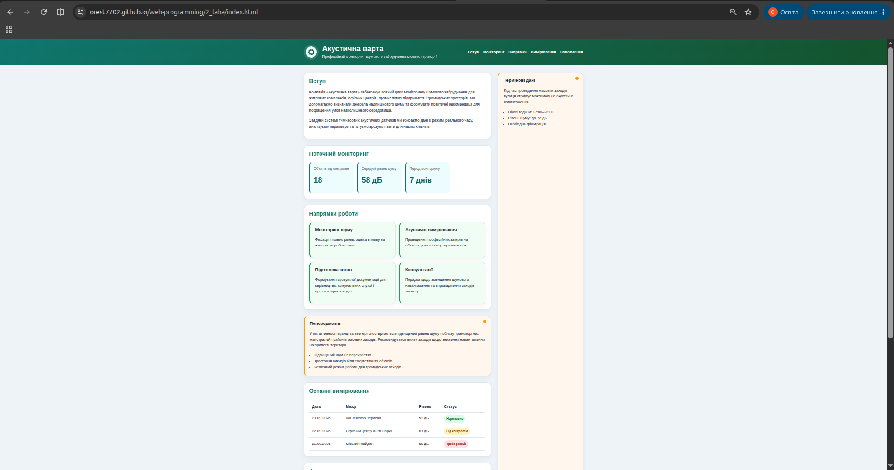

# Звіт до лабораторної роботи № 2

### Верстка сайту компанії згідно з інструкцією (HTML/CSS)

---
---

## Тема

Верстка статичного сайту з підключенням CSSстилів

## Мета роботи

Практично застосувати CSS для оформлення HTML-структури веб сторінки.

## Виконання роботи

---
---

## Результат

https://orest7702.github.io/web-programming/2_laba/index.html

## Висновок

>Під час виконання лабораторної роботи №2 я краще укріпив практичні навички створення статичних web-сторінок. Атакож я отримав практичні навички використання CSS для оформлення семантичної HTML-структури веб сторінки.